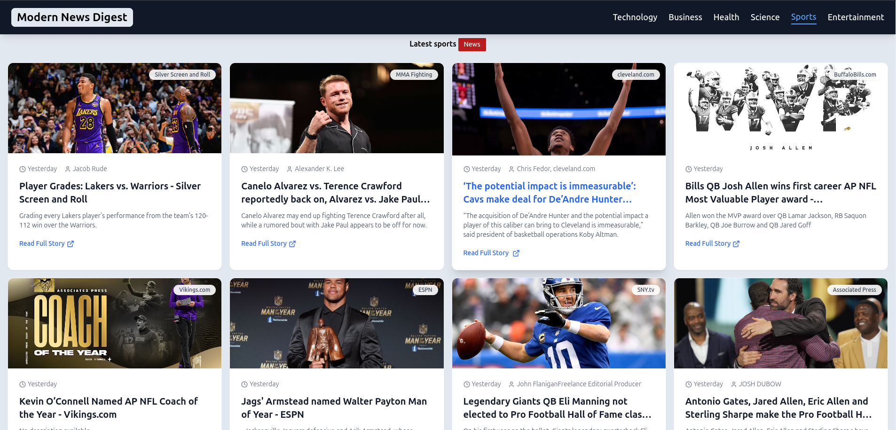
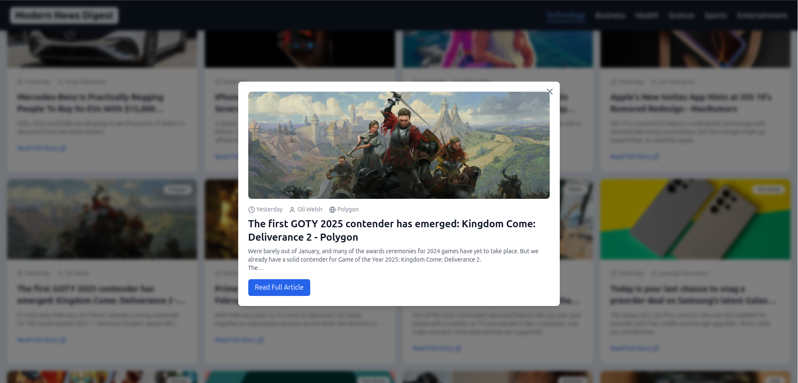

# 📰 Modern News Digest

**Modern News Digest** is a modern web application that helps users stay up-to-date with the latest news from around the world.  
Built with **React**, **Tailwind CSS**, and **News API**, it offers a seamless experience for browsing news articles by category and viewing detailed news information.

---

## 🌟 Features

✅ **Category-based News Browsing** – Explore news articles organized by categories  
✅ **Detailed News Views** – Get comprehensive news information and images  
✅ **📱 Responsive Design** – Enjoy a smooth experience across all devices  
✅ **✨ Interactive UI** – Smooth animations and transitions for better user engagement  
✅ **📖 Pagination** – Easy navigation through news collections  
✅ **📰 News Modal** – View detailed news information in a modal window  

---

## 🚀 Tech Stack

| **Usage**   | **Technology** |
|------------------|----------|
| 🏗 **Frontend Framework** | React |
| 🎨 **Styling** | Tailwind CSS |
| 🔥 **API** | News API |
| 📦 **UI Components** | Custom-built components |
| 🎭 **Icons** | Lucide React Icons |
| 💫 **Animations** | CSS animations |
| 🔀 **Routing** | React Router DOM |

---

## 📸 Screenshots

| Home Page | News Details |
|-----------|-------------|
|  |  |

---

## 🔑 Key Components

### 🔍 **News Browse**  
✔ Browse news articles by category  
✔ Search functionality  
✔ Pagination for news lists  
✔ Category filtering  

### 📰 **News Details**  
✔ Detailed news information  
✔ News images and category information  
✔ Interactive news views  

### 📰 **News Modal**  
✔ View detailed news information in a modal window  
✔ News images and category information  
✔ Interactive news views  

--- 
